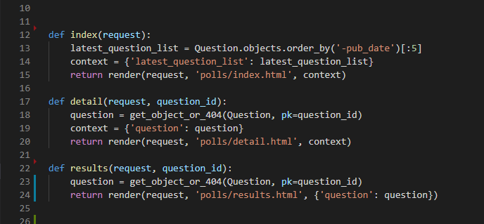

# ✔ 장고 튜토리얼 03 28 - 2

### 짧은 복습 😊

뷰 추가하기. 장고는 웹페이지를 위해 view를 사용하며 하나의 function으로 연결.
뷰가 실제로 무엇인가를 하게 하기.
뷰 펑션에서 DB에서 긁어온 내용을 그냥 바로 render하도록 함.
이때 render에서 (템플릿) 에서 리스트를 li로 loop하는 기능은 템플릿에서 작동함.

get_object_or_404() 함수의 사용. 없다면 404를 뿌리자.

---

## Part 4
https://docs.djangoproject.com/ko/3.1/intro/tutorial04/

> Write Minimal Form

> 제너릭 뷰 사용하기
The detail() (from Tutorial 3) and results() views are very short – and, as mentioned above, redundant. The index() view, which displays a list of polls, is similar.

> 이러한 뷰는 URL에서 전달 된 매개 변수에 따라 데이터베이스에서 데이터를 가져 오는 것과 템플릿을 로드하고 렌더링 된 템플릿을 리턴하는 기본 웹 개발의 일반적인 경우를 나타냅니다. Django는 이런 매우 일반적인 경우를 위해 《제너릭 뷰》시스템이라는 지름길을 제공합니다.

> 제너릭 뷰는 일반적인 패턴을 추상화하여 앱을 작성하기 위해 Python 코드를 작성하지 않아도됩니다.

> Let’s convert our poll app to use the generic views system, so we can delete a bunch of our own code. We’ll have to take a few steps to make the conversion. We will:

> * URLconf를 변환하십시오.
> * 불필요한 오래된보기 중 일부를 삭제하십시오.
> * Django의 제너릭 뷰를 기반으로 새로운 뷰를 도입하십시오.

> 다음으로 이전의 index, detail, results뷰를 제거하고 장고의 일반적인 뷰를 대신 사용하겠습니다. 그렇게하려면 polls/views.py 파일을 열고 다음과 같이 변경하십시오:

## Part 5 테스트
https://docs.djangoproject.com/ko/3.1/intro/tutorial05/

> 자동화된 테스트 
Tests are routines that check the operation of your code.

> 테스트는 다양한 수준에서 작동합니다. 일부 테스트는 작은 세부 사항에 적용될 수 있습니다 (특정 모델 메서드는 예상대로 값을 반환합니까?) 또 다른 테스트는 소프트웨어의 전반적인 작동을 검사합니다 (사이트에서 사용자 입력 시퀀스가 원하는 결과를 생성합니까?). 이것은 이전 튜토리얼 2장에서 **shell을 사용하여 메소드의 동작을 검사하거나 애플리케이션을 실행하고 어떻게 작동하는지 확인하기 위해 데이터를 입력해서 테스트했던 것과 다르지 않습니다.**

> 자동화 된 테스트에서 다른 점은 테스트 작업이 시스템에서 수행된다는 것입니다. 한 번 테스트 세트를 작성한 이후에는 앱을 변경할 때 수동 테스트를 수행하지 않아도 원래 의도대로 코드가 작동하는지 확인할 수 있습니다.

> A change in any of those components could have unexpected consequences on the application’s behavior. Checking that it still 〈seems to work〉 could mean running through your code’s functionality with twenty different variations of your test data to make sure you haven’t broken something - not a good use of your time.

> 그러나 테스트를 작성하는 작업은 어플리케이션을 수동으로 테스트하거나 새로 발견된 문제의 원인을 확인하는 데 많은 시간을 투자하는 것보다 훨씬 더 효과적입니다.

> **테스트는 문제를 그저 식별하는 것이 아니라 예방합니다.**
테스트를 그저 개발의 부정적 측면으로 생각하는 것은 실수입니다.
테스트가 없으면 어플리케이션의 목적 또는 의도 된 동작이 다소 불투명 할 수 있습니다. 심지어 자신의 코드 일 때도, 정확히 무엇을하고 있는지 알아 내려고 노력하게 됩니다.
테스트는 이 불투명함을 바꿉니다. 그들은 내부에서 코드를 밝혀 내고, 어떤 것이 잘못 될 때, 그것이 잘못되었다는 것을 깨닫지 못했다고 할지라도, 잘못된 부분에 빛을 집중시킵니다.

> **테스트가 코드를 더 매력적으로 만듭니다.**
You might have created a brilliant piece of software, but you will find that many other developers will refuse to look at it because it lacks tests; without tests, they won’t trust it. Jacob Kaplan-Moss, one of Django’s original developers, says **《Code without tests is broken by design.》**
테스트 작성을 시작해야하는 또다른 이유는 다른 개발자들이 당신의 소프트웨어를 사용하는것을 진지하게 고려하기 전에 테스트 코드를 보기를 원하기 때문입니다.

* 테스트 부분이 제일 어렵네

## PART 6. 정적 파일 다루기.

* Static 폴더의 생성 (template와 비슷함)

## PART 7. 관리자 폼 커스터마이징

## TO Do
* 튜토리얼 복습하면서 짧은 게시판 하나 만들기.

